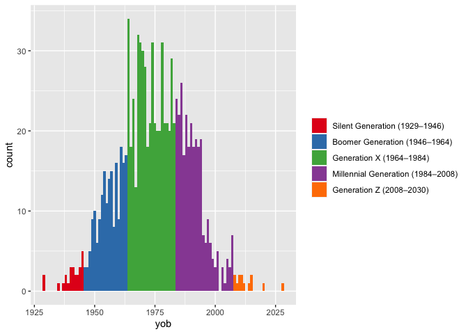
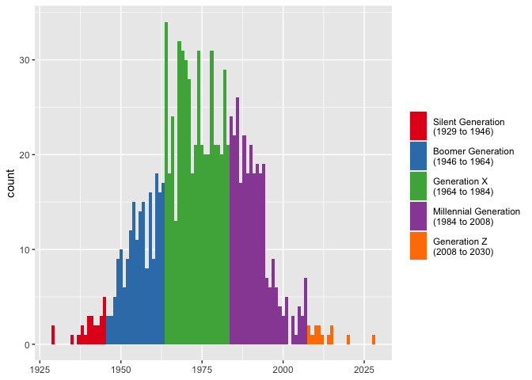
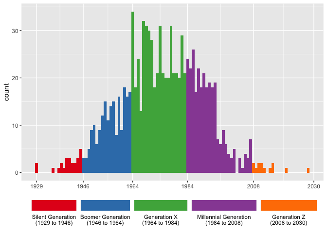

# generations

Convert birth years to generation names.

This package contains functions that will convert years of birth into
names of generational cohorts. For example, `1989` becomes
`"Millennial"`. The package contains several helper functions to modify
the underlying lookup table as well as way to query it.

## Installation

The package currently lives on GitHub, so you can install it like you
would with any other package on GitHub:

``` r
remotes::install_github("joeystanley/generations")
```

You can then load it like you can with any library.

``` r
library(generations)
```

For the purposes of this tutorial, I’ll load `ggplot` as well.

``` r
library(dplyr)
library(ggplot2)
```

## Converting years to generations

The main function in this package is `generations`. Given a vector of
integers, it’ll return a factor of generation names. First, I’ll
generate some random years of birth.

``` r
yobs <- floor(runif(10, 1900, 2020))
yobs
```

    ##  [1] 1908 1998 2013 1932 1920 1904 1921 1976 1902 1900

I can now easy convert that into generations.

``` r
generations(yobs)
```

    ##  [1] G.I.       Millennial Gen Z      Silent     G.I.       Lost      
    ##  [7] G.I.       Gen X      Lost       Lost      
    ## Levels: Lost G.I. Silent Gen X Millennial Gen Z

This function works on any year betwen 1435 and 2030. Numbers outside
that range return `NA`.

Note that by default, the function will return the vector as *factor*,
with the levels ordered so that the oldest generation in the vector is
first. To get a character vector instead, add the argument `as_factor =
FALSE`.

### Customizing output

There are some tweaks you can do to adjust the output of `generations`.
First, you can return longer forms of the generational names by
specifying `full_names = TRUE`.

``` r
generations(yobs, full_names = TRUE)
```

    ##  [1] G.I. Generation       Millennial Generation Generation Z         
    ##  [4] Silent Generation     G.I. Generation       Lost Generation      
    ##  [7] G.I. Generation       Generation X          Lost Generation      
    ## [10] Lost Generation      
    ## 6 Levels: Lost Generation G.I. Generation Silent Generation ... Generation Z

What this does is simply add `"Generation"` to the end of each one,
unless it’s `"Gen X"` (or Y, or Z), in which case it’ll expand it out to
simply `"Generation X"`.

You can also show the years included in each generation by adding the
`years = TRUE` argument. This will add a space and, inside a pair of
parentheses, the start and end years of that generation, separated by an
en dash.

``` r
generations(yobs, years = TRUE)
```

    ##  [1] G.I. (1908–1929)       Millennial (1984–2008) Gen Z (2008–2030)     
    ##  [4] Silent (1929–1946)     G.I. (1908–1929)       Lost (1886–1908)      
    ##  [7] G.I. (1908–1929)       Gen X (1964–1984)      Lost (1886–1908)      
    ## [10] Lost (1886–1908)      
    ## 6 Levels: Lost (1886–1908) G.I. (1908–1929) ... Gen Z (2008–2030)

The primary purpose of this is for visualizations, since not everyone is
familiar with (or agrees with) the year ranges.

``` r
many_yobs <- tibble(yob = floor(rnorm(1000, 1975, 15))) %>%
  mutate(gen = generations(yob, full_names = TRUE, years = TRUE))
ggplot(many_yobs, aes(yob, fill = gen)) + 
  geom_histogram(binwidth = 1) + 
  scale_fill_brewer(name = NULL, palette = "Set1")
```

<!-- -->

How this additional portion is formatted can be adjusted. If rendering
an en dash is troublesome for you, you can change it to something else
with `years_range_sep`. You may also want to change the space between
the generation name and the opening parenthesis into a newline character
with `years_sep`, again for visualization purposes.

``` r
many_yobs <- many_yobs %>%
  mutate(gen = generations(yob, full_names = TRUE, years = TRUE,
                           years_sep = "\n", years_range_sep = " to "))

ggplot(many_yobs, aes(yob, fill = gen)) + 
  geom_histogram(binwidth = 1) + 
  scale_fill_brewer(name = NULL, palette = "Set1") + 
  labs(x = NULL) + 
  theme(legend.key.height = unit(1, "cm"))
```

<!-- -->

If you want to get really fancy, you can make the legend keys
approximate the width they take up on the *x*-axis and put better tics
marks.

``` r
widths <- many_yobs %>%
  group_by(gen) %>%
  summarize(width = max(yob) - min(yob)) %>%
  ungroup() %>%
  mutate(width = width / max(width) * 1.4) # you may have to fudge this a little more

ggplot(many_yobs, aes(yob, fill = gen)) + 
  geom_histogram(binwidth = 1) + 
  scale_fill_brewer(name = NULL, palette = "Set1") + 
  scale_x_continuous(breaks = c(1929, 1946, 1964, 1984, 2008, 2030)) + 
  labs(x = NULL) + 
  theme(legend.position = "bottom") + 
  guides(fill = guide_legend(nrow = 1, label.position = "bottom", 
                             keywidth = widths$width, default.unit = "inches"))
```

<!-- -->

## Querying generation data

To see a list of the generational data, you can use `show_generations`,
which will return a data frame containing the names, start years, and
end years.

``` r
show_generations()
```

    ##              name start  end
    ## 1           Gen Z  2008 2030
    ## 2      Millennial  1984 2008
    ## 3           Gen X  1964 1984
    ## 4          Boomer  1946 1964
    ## 5          Silent  1929 1946
    ## 6            G.I.  1908 1929
    ## 7            Lost  1886 1908
    ## 8      Missionary  1865 1886
    ## 9     Progressive  1844 1865
    ## 10         Gilded  1822 1844
    ## 11 Transcendental  1794 1822
    ## 12     Compromise  1773 1794
    ## 13     Republican  1746 1773
    ## 14        Liberty  1727 1746
    ## 15      Awakening  1704 1727
    ## 16  Enlightenment  1675 1704
    ## 17       Glorious  1649 1675
    ## 18       Cavalier  1621 1649
    ## 19        Puritan  1594 1621
    ## 20  Parliamentary  1569 1594
    ## 21    Elizabethan  1542 1569
    ## 22       Reprisal  1517 1542
    ## 23    Reformation  1497 1517
    ## 24       Humanist  1459 1497
    ## 25     Aurthurian  1435 1459

You can also get simple information. For example, if you want to know
when the start or end year of a particular generation is, you can use
`get_start()` or `get_end()`:

``` r
get_start("Silent")
```

    ## [1] 1929

``` r
get_end("Millennial")
```

    ## [1] 2008

You can also find the names of neighboring generations with
`get_prev_gen()` and `get_next_gen()`.

``` r
get_next_gen("Millennial")
```

    ## [1] "Gen Z"

``` r
get_prev_gen("Missionary")
```

    ## [1] "Progressive"

Note that if ask for something newer than Gen Z or older than Aurthurian
it will return `NA`.

## Customizing generation data

The data that this package uses is loaded as a hidden object when you
load the package. You may modify it with the functions described in this
section. These changes will affect the dataset so long as the
`generations` package is loaded. You’ll have to reset the data each time
to reload it.

The labels and years for each generation are mostly borrowed from Howe &
Strauss’ Generational Theory books. However, not everyone agrees on the
names and year ranges for the various generations. For this reason, the
generations package makes it easy to modify the generations data to your
liking.

To rename a generation, use `rename_generation()`, with the old name
first and the new name second. For example, if you want to use *Zoomer*
instead of *Gen Z*, you can do so.

``` r
rename_generation("Gen Z", "Zoomer")
```

    ## Gen Z has been renamed Zoomer

You’ll get a message informing you that the change has been made. If you
now run `show_generations()` you’ll see that the change has been made
and if you rerun `generations()`, you’ll get updated results.

``` r
show_generations()
```

    ##              name start  end
    ## 1          Zoomer  2008 2030
    ## 2      Millennial  1984 2008
    ## 3           Gen X  1964 1984
    ## 4          Boomer  1946 1964
    ## 5          Silent  1929 1946
    ## 6            G.I.  1908 1929
    ## 7            Lost  1886 1908
    ## 8      Missionary  1865 1886
    ## 9     Progressive  1844 1865
    ## 10         Gilded  1822 1844
    ## 11 Transcendental  1794 1822
    ## 12     Compromise  1773 1794
    ## 13     Republican  1746 1773
    ## 14        Liberty  1727 1746
    ## 15      Awakening  1704 1727
    ## 16  Enlightenment  1675 1704
    ## 17       Glorious  1649 1675
    ## 18       Cavalier  1621 1649
    ## 19        Puritan  1594 1621
    ## 20  Parliamentary  1569 1594
    ## 21    Elizabethan  1542 1569
    ## 22       Reprisal  1517 1542
    ## 23    Reformation  1497 1517
    ## 24       Humanist  1459 1497
    ## 25     Aurthurian  1435 1459

``` r
generations(yobs)
```

    ##  [1] G.I.       Millennial Zoomer     Silent     G.I.       Lost      
    ##  [7] G.I.       Gen X      Lost       Lost      
    ## Levels: Lost G.I. Silent Gen X Millennial Zoomer

Because many people may want to use the term *Zoomer* instead of *Gen
Z*, a shortcut function, `use_zoomer`, which is just a wrapper around
`rename_generation("Gen Z", "Zoomer")`, is included in the package. The
other shortcut functions are `use_gen_y()`, `use_13th()`,
`use_baby_boom()` as well as their reciprocals `use_gen_z()`,
`use_millennial()`, `use_gen_x()` and `use_boomer()`.

You may also want to change the years. For example, many people consider
1997 as the end of the Millennial Generation. You can make this change
with `redefine_generation`. With this function, you must specify the new
start and the new end year.

``` r
redefine_generation("Millennial", 1983, 1997)
```

    ## Gen X is now from 1964 to 1982

    ## Millennial is now from 1983 to 1997

    ## Zoomer is now from 1998 to 2030

Since changing one generation impacts adjacent generations, you’ll get a
message showing you what the new ranges are for this, the previous, and
the next generations.

You can reset the data back to its original form with
`reset_generations()`.
